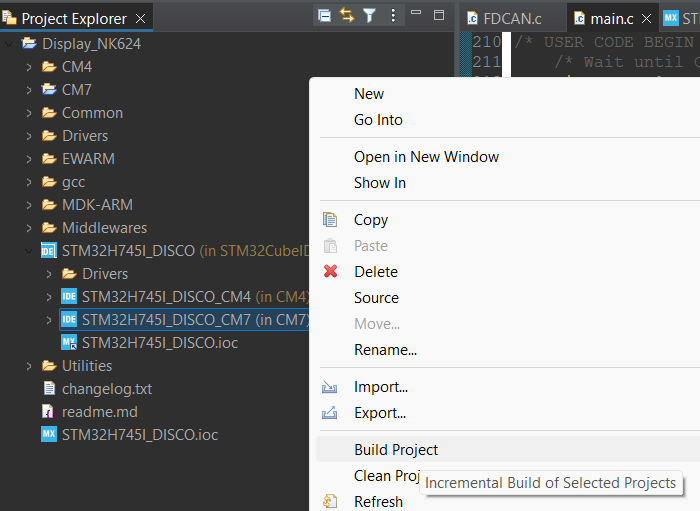
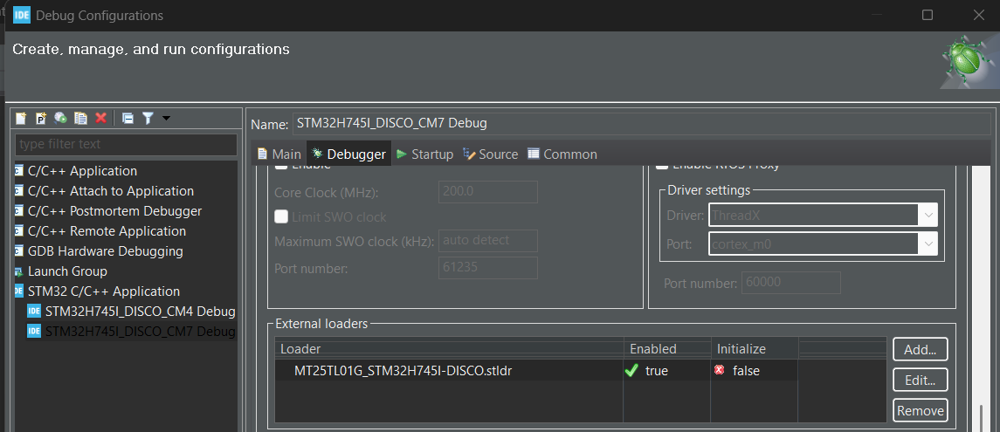
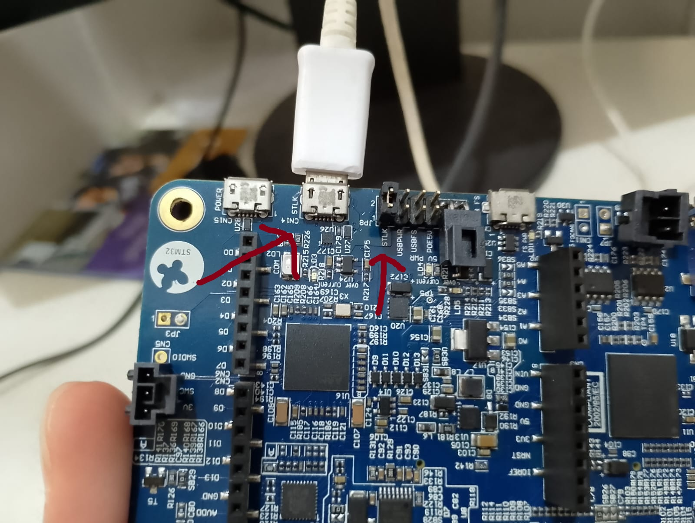

# DISPLAY

Repositório para o código do Display  ara auxiliar o piloto nas provas dinâmicas, como também a equipe Fórmula Tesla na testagem do carro.

## Histórico de Desenvolvimento

- 2024: Versão inicial estável desenvolvida por https://github.com/Biel-013. O Display funcionou no barramento CAN do carro lendo todos os dados que chegavam de lá, exibindo-os em tempo real no display.

- Jun/2025: Ajustes pontuais e elaboração dessa documentação por https://github.com/RaphaelLeivas

## Configuração do Ambiente de Desenvolvimento

### Instale os Softwares / IDEs

- TouchGFX Designer v4.22.1
- STM32CubeIDE v1.14.1
- STM32CubeProgrammer v2.19
- ST-Link Utility 4.6.0

O Firmware interno do STLink da placa era V3. Isso a gente não tem como atualizar direto, deixo aqui só para informação da versão mesmo.

Na dúvida, siga esse [link](https://support.touchgfx.com/docs/introduction/installation) - mas instalando as versões listadas acima.

### Configurando

Abra o arquivo localizado em CM7/TouchGFX/Display_NK624.touchgfx dentro da IDE do TouchGFX Designer

Gere o código usando o botão Generate Code no canto inferior direito

Simule o projeto no TouchGFX para ver se o build deu certo

Agora abra o gerenciador de arquivos do WIndows, e clique duas vezes no arquivo localizado em STM32CubeIDE\CM7\.project. Ele vai abrir o projeto no CubeIDE.

Faça o build do projeto da seguinte forma:

- Clique sobre o nome STM32H745I_DISCO_CM7 (dentro da pasta do STM32CubeIDE)
- Clique com o botão direto e faça o build

Agora temos que configurar o debugger para ele saber tratar os dois cores. Siga as páginas 11 a 16 do [tutorial](https://www.st.com/resource/en/application_note/dm00629855-getting-started-with-projects-based-on-dualcore-stm32h7-microcontrollers-in-stm32cubeide-stmicroelectronics.pdf). Se as duas configurações do CM4 e CM7 não aparecerem no pop up de configuração do debugger, crie uma nova e deixa-as igual mostra o tutorial acima.

OBS: é possível que essas configurações já estejam prontas, mas é bom passar por elas uma a uma igual no tutorial para ter certeza que elas estão setadas.

OBS: sempre que for buildar e debugar / run, clique com o botão direito diretamente sobre o STM32H745I_DISCO_CM7 e faça por lá, certificando que a configuração que acabamos de configurar está selecionada e rodando.

Agora vá na debug configuration do CM7 e adicione o external loader a seguir: basta clicar em Add... e selecionar o nome no seletor dropdown

### Gravando a PCB

Se certifique que o jumper J8 na parte de trás da PCB está em cima dos conectores do STLK para gravar. Sem isso ele não reconhece a PCB, e que o cabo USB entre o computador e a PCB também está ligado no ST-LINK:

Conecte a PCB no PC e rode o RUN (ou o Debug) configurado no passo anterior.

Se der tudo certo, o display vai ser atualizado com o código após alguns minutos.

## Metodologia de Desenvolvimento

Sempre que quiser mexer no design gráfico, faça pelo TouchGFX, generate code e depois abra a CubeIDE e faça a gravação na PCB por lá.

Se quiser mexer na HAL / periféricos, também faça pelo CubeIDE e grave por lá.

Todo o código importante para nós está em STM32CubeIDE\CM7\Application\User e no arquivo .IOC em STM32H745I_DISCO.ioc, que fica no primeiro diretório do repositório. Não mexemos no processador Cortex-M4, somente o no M7.  

## Links Úteis, Recursos

Entender mais sobre como trabalhar com processadores dual core

https://youtube.com/playlist?list=PLfIJKC1ud8ghx7DRNbhVbWi7n7Ty0YstS&si=J_6aQti91ZGUclp9 

https://www.st.com/resource/en/application_note/dm00629855-getting-started-with-projects-based-on-dualcore-stm32h7-microcontrollers-in-stm32cubeide-stmicroelectronics.pdf 

Entender como desenvolver com o TouchGFX + CubeIDE + Display

https://youtube.com/playlist?list=PLfIJKC1ud8giOsk-C4BCOwSHtbXqTNb1W&si=dkKXarc1gZIgousy 

Exemplos com a PCB do Display da STM

https://github.com/STMicroelectronics/STM32CubeH7/blob/master/Projects/STM32H745I-DISCO/Demonstrations/readme.txt    

- Documentação do próprio TouchGFX (manual dele) - http://support.touchgfx.com  
- Para aprender mais sobre o CubeIDE, procure tutoriais de processadores com somente 1 core e sem display, aí você aprende sobre o IOC, HAL, debug, etc.

Explicação do external loader

https://youtu.be/Q-mfuzW6S-0?si=zi-KmDOvToVxbrex  

## STM32H745I_DISCO TBS

The TouchGFX Board Setup (TBS) STM32H745I_DISCO has target compiler support for IAR and GCC, Keil and STM32CubeIDE. Flashing the board requires STM32CubeProgrammer which can be downloaded from the ST webpage.

This TBS is configured for 272 x 480 pixels 16bpp screen resolution.

Performance testing can be done using the GPIO pins designated with the following signals: VSYNC_FREQ - Pin PB6 (D1), RENDER_TIME - Pin PB7 (D0), FRAME_RATE - Pin PG3 (D2), MCU_ACTIVE - Pin PA6 (D3).
